# Deployment Flow Documentation

This document explains the complete CI/CD and deployment flow for the Aurora Glam salon booking platform.

## Overview

The platform uses a **GitOps** approach with:
- **GitHub Actions** for CI/CD pipelines
- **ArgoCD** for Kubernetes deployment
- **Separate staging and production environments**

---

## Architecture Diagram

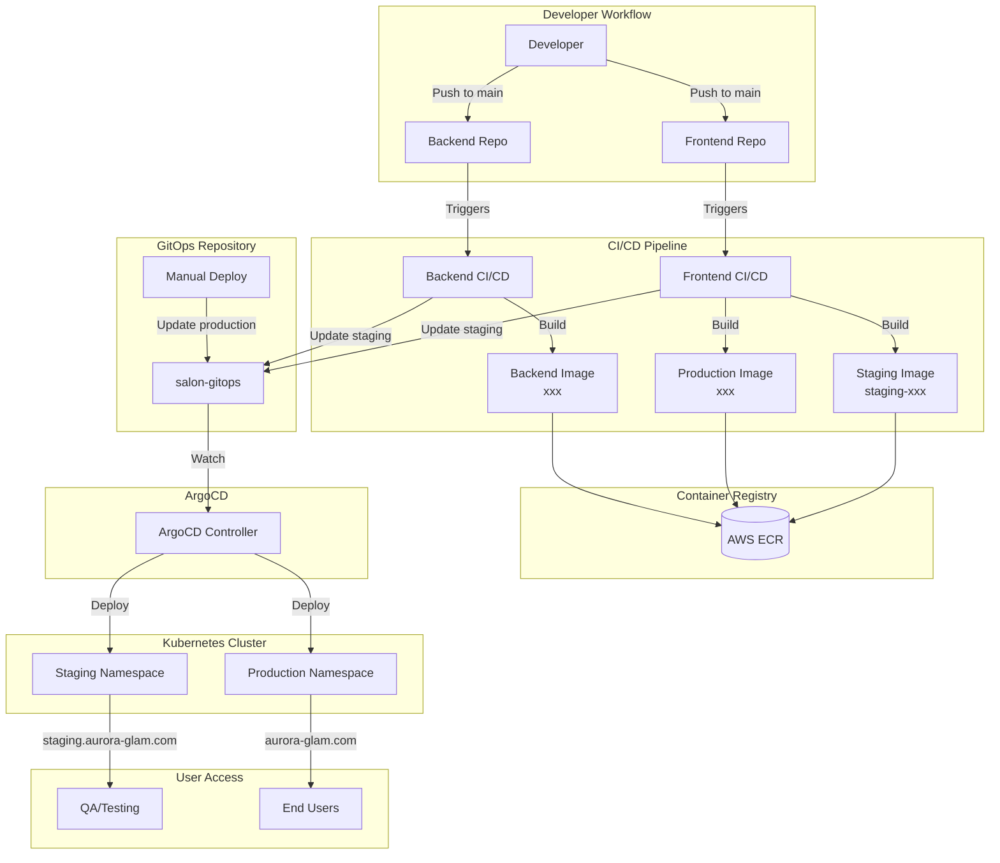

---

## Frontend CI/CD Flow

### Trigger
- Push to `main` branch
- Pull request to `main`
- Manual workflow dispatch

### Pipeline Stages

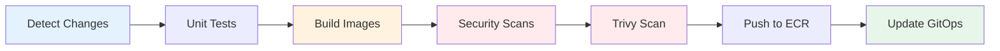

### Build Stage Details

The frontend CI/CD builds **TWO separate Docker images**:

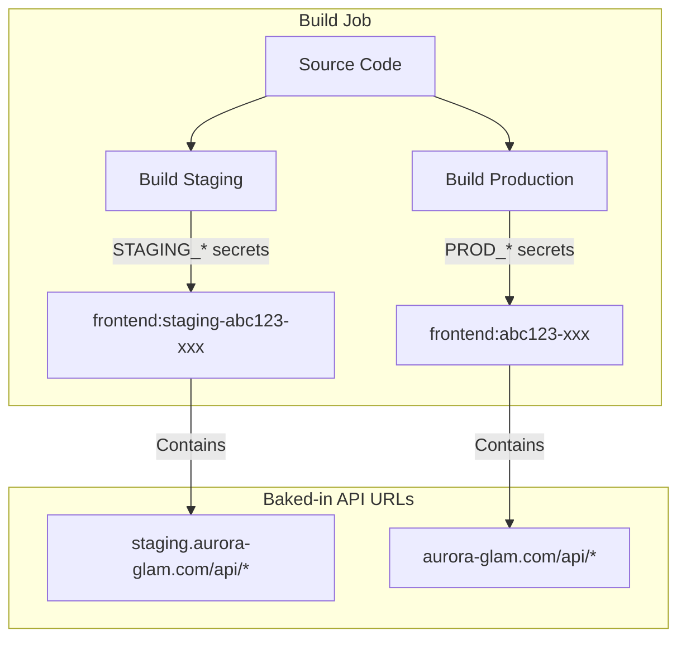

| Image | Tag Format | API URLs Point To |
|-------|-----------|-------------------|
| Staging | `frontend:staging-{sha}-{timestamp}` | `staging.aurora-glam.com/api/*` |
| Production | `frontend:{sha}-{timestamp}` | `aurora-glam.com/api/*` |

### Why Two Images?

Next.js bakes environment variables at **build time**. A single image with production URLs deployed to staging would cause:
- ❌ CORS errors (staging domain calling production APIs)
- ❌ Data leakage between environments
- ❌ Testing against wrong data

---

## Backend CI/CD Flow

### Pipeline Stages

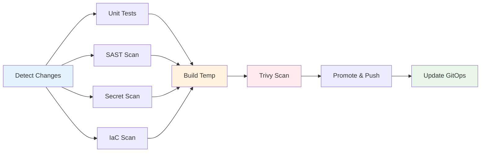

### Backend Image Strategy

Backend services build **ONE image** that works in both environments:
- Backend services **ARE** the APIs (they don't call other APIs)
- Environment-specific config comes from Kubernetes secrets
- Same image, different runtime configuration

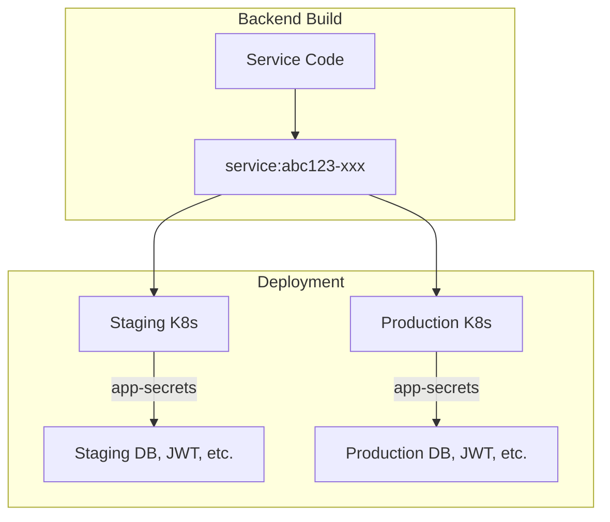

---

## GitOps Update Flow

### Automatic (CI/CD)

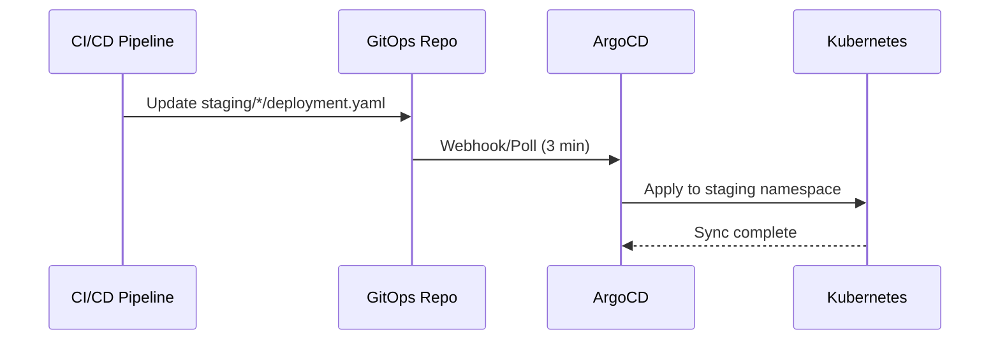

### Manual Production Deployment

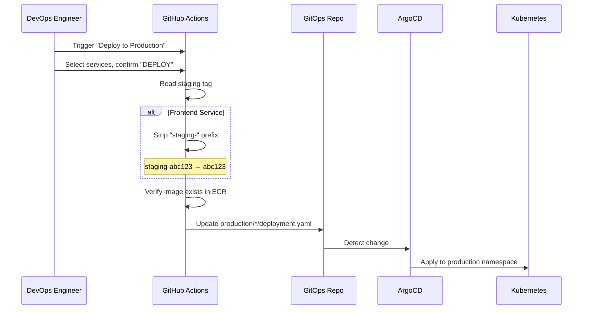

---

## ArgoCD Configuration

### Application Structure

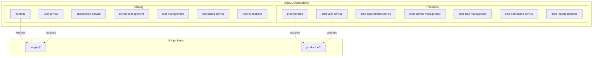

### Sync Policy

All ArgoCD applications have:
- **Automated sync**: Enabled
- **Prune**: True (removes deleted resources)
- **Self-heal**: True (reverts manual changes)

---

## Image Tag Flow

### Frontend

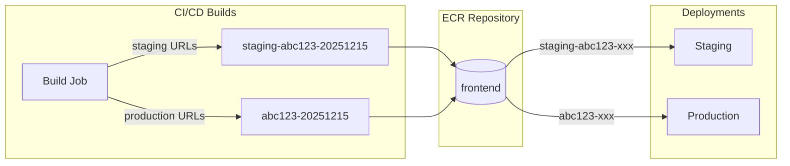

### Backend Services

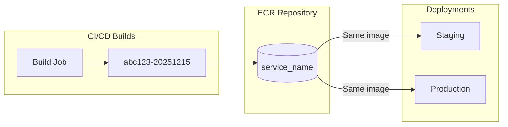

---

## Manual Production Deployment

### How to Deploy

1. Go to **GitHub** → `salon-gitops` repository
2. Navigate to **Actions** → **Deploy to Production**
3. Click **Run workflow**

### Workflow Inputs

| Input | Options | Description |
|-------|---------|-------------|
| Services | `all`, `frontend`, `user_service`, etc. | Which services to deploy |
| Image Source | `promote-staging`, `specific-tag` | Use staging tag or custom tag |
| Specific Tag | (optional) | Custom tag if not promoting staging |
| Confirm | `DEPLOY` | Type exactly "DEPLOY" to confirm |

### Frontend Tag Transformation

When promoting frontend from staging to production:

```
Staging tag:    staging-abc12345-20251215123456
                   ↓ (strip "staging-" prefix)
Production tag: abc12345-20251215123456
```

This works because CI/CD builds both images with the same base tag, just different prefixes.

---

## Environment URLs

| Environment | Frontend URL | API Base URL |
|-------------|--------------|--------------|
| Staging | `https://staging.aurora-glam.com` | `https://staging.aurora-glam.com/api/*` |
| Production | `https://aurora-glam.com` | `https://aurora-glam.com/api/*` |

### API Routing

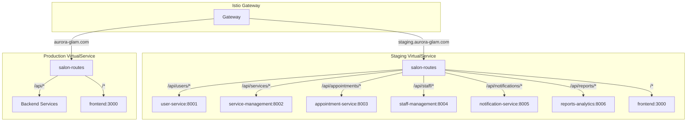

---

## Troubleshooting

### CORS Errors on Staging

**Symptom**: Staging frontend shows CORS errors when calling APIs

**Cause**: Staging frontend is calling production APIs (wrong image deployed)

**Solution**: Ensure staging deployment uses `frontend:staging-xxx` image with staging API URLs baked in

### ArgoCD Not Syncing

**Check**:
1. ArgoCD application status at `https://argocd.aurora-glam.com`
2. GitOps repository has the latest changes
3. Application sync policy is set to automated

### Image Not Found in ECR

**When deploying to production**:
1. Verify CI/CD pipeline completed successfully
2. Check ECR repository for the expected tag
3. For frontend, ensure both `staging-xxx` and `xxx` tags exist

---

## Repository Structure

```
salon-gitops/
├── argocd/                    # ArgoCD Application manifests
│   ├── frontend.yaml          # Staging frontend app
│   ├── prod-frontend.yaml     # Production frontend app
│   ├── user_service.yaml      # Staging user service
│   ├── prod-user_service.yaml # Production user service
│   └── ...
├── staging/                   # Staging K8s manifests
│   ├── frontend/
│   │   └── deployment.yaml
│   ├── user_service/
│   │   ├── deployment.yaml
│   │   ├── service.yaml
│   │   └── hpa.yaml
│   └── ...
├── production/                # Production K8s manifests
│   ├── frontend/
│   ├── user_service/
│   └── ...
├── istio/                     # Istio configuration
│   └── gateway.yaml
└── .github/workflows/
    └── deploy-production.yml  # Manual production deployment
```

---

## Related Documentation

- [Infrastructure Domain Guide](./INFRASTRUCTURE_DOMAIN_GUIDE.md)
- [Deployment Architecture](./DEPLOYMENT_ARCHITECTURE.md)
