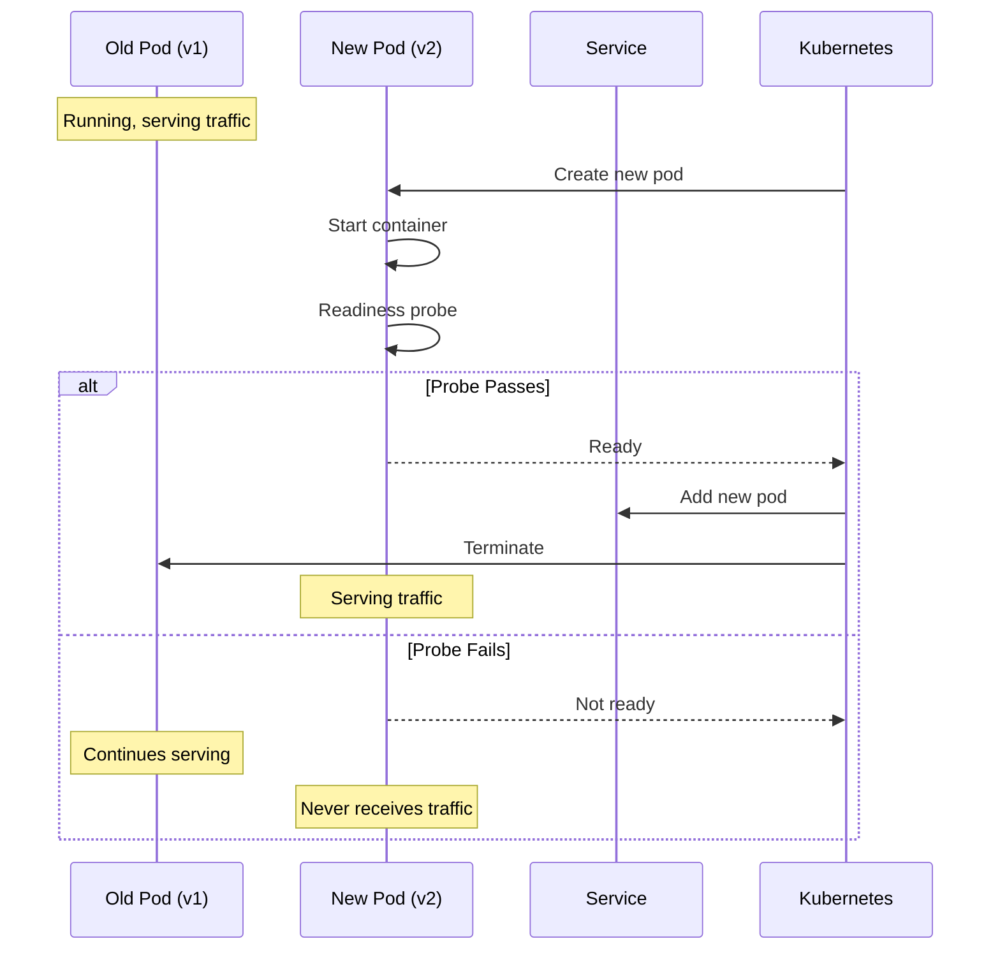
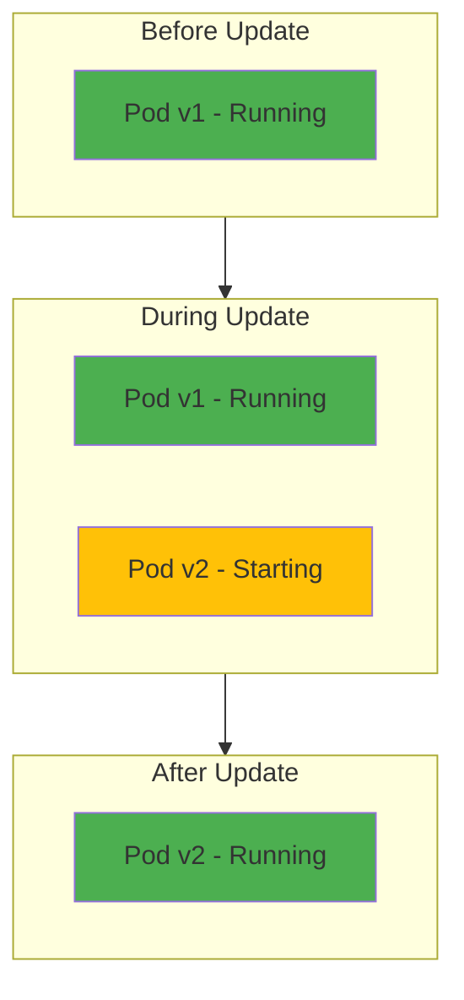
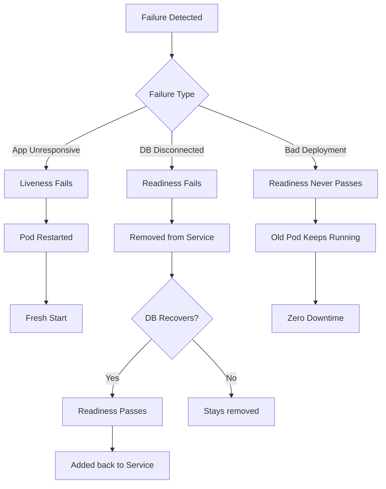

# Deployment Strategy

## Table of Contents

1. [Overview](#overview)
2. [Rolling Update Strategy](#rolling-update-strategy)
3. [Health Probes](#health-probes)
4. [Zero-Downtime Deployment](#zero-downtime-deployment)
5. [Automatic Recovery](#automatic-recovery)

---

## Overview

All microservice deployments use a rolling update strategy with health probes to ensure zero-downtime deployments and automatic recovery from failures.

---

## Rolling Update Strategy

### Configuration

```yaml
strategy:
  type: RollingUpdate
  rollingUpdate:
    maxUnavailable: 0
    maxSurge: 1
```

| Parameter | Value | Description |
|-----------|-------|-------------|
| maxUnavailable | 0 | Never terminate old pod before new is ready |
| maxSurge | 1 | Create at most 1 extra pod during update |

### Deployment Flow



---

## Health Probes

### Readiness Probe

Determines if pod should receive traffic.

```yaml
readinessProbe:
  httpGet:
    path: /health
    port: <service-port>
  initialDelaySeconds: 5
  periodSeconds: 10
  timeoutSeconds: 5
  failureThreshold: 3
  successThreshold: 1
```

**Behavior:**
- Checks `/health` endpoint every 10 seconds
- Removes pod from Service after 3 failures
- Pod stays running but receives no traffic

### Liveness Probe

Determines if pod should be restarted.

```yaml
livenessProbe:
  httpGet:
    path: /health
    port: <service-port>
  initialDelaySeconds: 15
  periodSeconds: 20
  timeoutSeconds: 5
  failureThreshold: 3
```

**Behavior:**
- Checks `/health` endpoint every 20 seconds
- Restarts pod after 3 consecutive failures
- Catches zombie/stuck processes

---

## Zero-Downtime Deployment

### How It Works



### Key Guarantees

| Scenario | Behavior |
|----------|----------|
| Normal deployment | Old pod serves until new is ready |
| New pod crashes | Old pod continues, new pod never added |
| New pod fails health check | Old pod continues, deployment stalls |
| Database connection lost | Pod removed from service, no traffic |

---

## Automatic Recovery

### Recovery Scenarios



### Rollback Options

| Method | Command | Description |
|--------|---------|-------------|
| Git Revert | `git revert HEAD` in salon-gitops | ArgoCD auto-syncs previous version |
| ArgoCD UI | History → Rollback | Select previous sync |
| kubectl | `kubectl rollout undo` | Requires disabling ArgoCD selfHeal |

---

## Service Configuration

| Service | Port | Deployment File |
|---------|------|-----------------|
| user_service | 8001 | `staging/user_service/deployment.yaml` |
| service_management | 8002 | `staging/service_management/deployment.yaml` |
| staff_management | 8003 | `staging/staff_management/deployment.yaml` |
| appointment_service | 8004 | `staging/appointment_service/deployment.yaml` |
| notification_service | 8005 | `staging/notification_service/deployment.yaml` |
| reports_analytics | 8006 | `staging/reports_analytics/deployment.yaml` |
